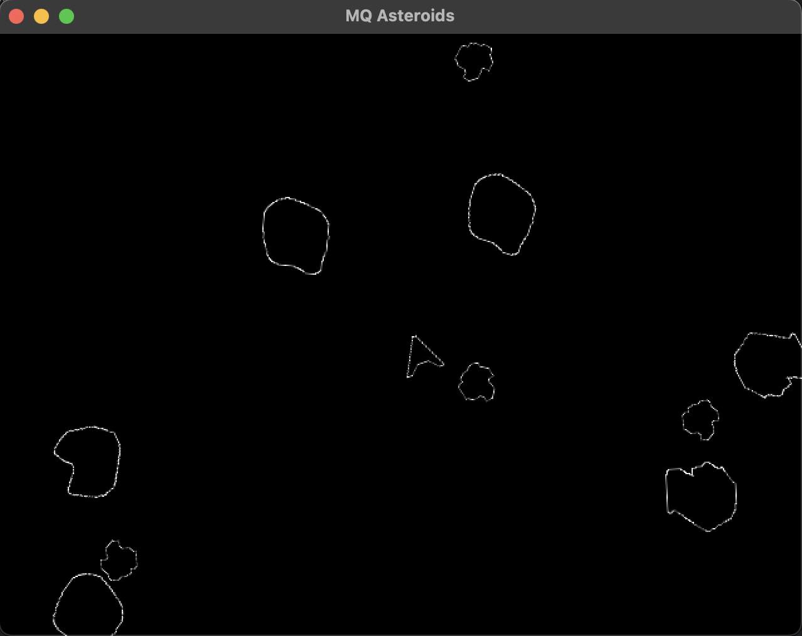

### Macroquad Asteroids

Super simple Asteroids implementation written in Rust, using the Macroquad crate.

Using this to learn the basics of Macroquad, and Rust at the same time. Ignore the bad conventions.

This is likely wildly over-engineered. But it works.

All Assets were created by me for this project. Feel free to use them however you see fit.
